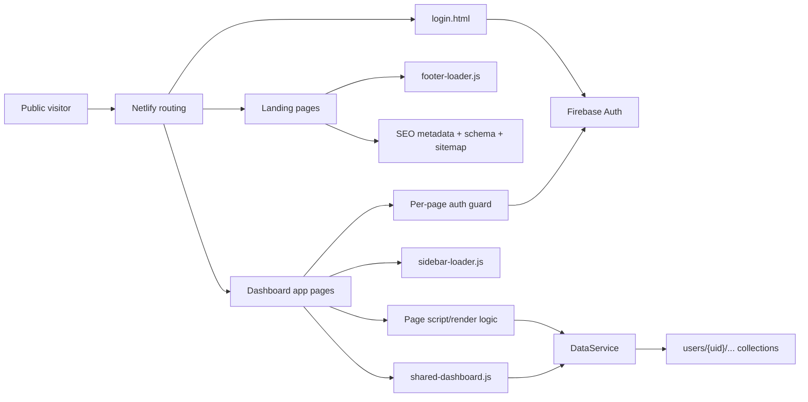

# FluxyOS System Design

Implementation architecture for extending FluxyOS without breaking existing
dashboard logic, Firestore data, SEO, or Netlify routing.

Read this with `PROJECT_BACKGROUND.md`, `COMPONENT_GUIDE.md`, and
`QA_CHECKLIST.md` before adding any new page, collection, shared component, or
dashboard feature.

---

## 1. Product Purpose

FluxyOS is a finance operations platform for Indonesian SMBs and finance teams.
It brings ledgers, vendor spend, bills, subscriptions, receipts, revenue feeds,
budgets, and AI finance workflows into one operational dashboard.

The current product is intentionally simple:

- Static HTML pages
- Vanilla JavaScript modules
- Firebase Auth
- Firestore user-scoped collections
- Netlify hosting and redirects
- No frontend framework or build step

The design goal is not to add abstractions for their own sake. The goal is to
keep each page easy to ship while protecting shared contracts that many pages
depend on.

---

## 2. Architecture Overview

### Request and data flow

Public pages are served directly by Netlify as static files. Landing pages load
marketing scripts, SEO metadata, and the shared footer. They should not read or
write Firestore.

App pages must authenticate with Firebase before loading user data. Once a user
is available, page-specific render functions call `DataService`, which reads or
writes Firestore under `users/{userId}/`.

Shared UI helpers such as modals, toasts, empty states, shimmer rows, sidebar,
footer, and AI drawer can be reused across pages. These helpers are stable
contracts. Extend them carefully and keep existing behavior backward-compatible.

---

## 3. Layers and Ownership

| Layer | Owns | Main files | Rules |
|---|---|---|---|
| Marketing | Public pages, SEO, CTAs, footer | `fluxyos.html`, feature pages, `pricing.html`, `includes/footer.html` | No Firestore writes. Must keep SEO tags, canonical URLs, schema, sitemap, and footer behavior aligned. |
| Auth | Login and session gates | `login.html`, inline auth guards in app pages | Dashboard pages must redirect unauthenticated users to `/login`. |
| App shell | Sidebar, app layout, shared dashboard CSS | `sidebar-loader.js`, `shared-dashboard.css`, app HTML files | Every app page needs `#sidebar`, shared CSS, sidebar loader, and shared dashboard JS. |
| Domain/data | Firestore access and calculations | `assets/js/db-service.js` | Dashboard features must use `DataService` for Firestore access. Do not scatter raw collection logic through pages. |
| Shared UI | Modal, toast, empty state, shimmer, AI drawer toggle | `assets/js/shared-dashboard.js`, `assets/js/ai-chat.js` | Global `window.*` APIs must remain backward-compatible. |
| Deployment | Clean URLs, canonical domain, API rewrites | `netlify.toml`, root static files | Do not break `/api/v1/*`, canonical domain redirects, sitemap, robots, or root homepage routing. |

---

## 4. Module Contracts

### `DataService`

`assets/js/db-service.js` is the approved Firestore access layer for dashboard
features. New Firestore reads or writes should be added here first, then called
from page controllers or shared UI.

Current responsibilities:

- `getTransactions(userId, limitCount = 50)`
- `addTransaction(userId, data)`
- `getBills(userId)`
- `addBill(userId, data)`
- `getSubscriptions(userId)`
- `addSubscription(userId, data)`
- `getDashboardStats(userId)`

Rules:

- Every collection path must be under `users/{userId}/`.
- New documents that represent user activity should use `serverTimestamp()`.
- Amounts must be raw numbers in Firestore, never formatted strings.
- Query ordering should be newest first unless a feature explicitly requires a different order.
- If a new collection exists, document its schema in `PROJECT_BACKGROUND.md` before using it.

### Page controllers

A page controller is the inline or page-specific JavaScript that renders one
page and owns that page's event handlers.

Rules:

- A page controller owns one page only.
- Do not make one page depend on DOM IDs from another page.
- Shared behavior belongs in `shared-dashboard.js`, `sidebar-loader.js`,
  `footer-loader.js`, `db-service.js`, or a new shared file.
- Rendering functions should tolerate empty data and show empty states rather
  than leaving blank panels.

### Shared `window.*` APIs

These functions are public internal APIs:

- `window.showAddTransactionModal(options)`
- `window.closeAddTransactionModal()`
- `window.showToast(message, type)`
- `window.renderEmptyState(containerId, config)`
- `window.renderShimmer(containerId, rowCount)`
- `window.toggleFluxyAI(state)`

Rules:

- Do not rename these functions.
- Do not remove existing option fields.
- New options must be optional and have defaults.
- Existing modal contexts (`transaction`, `bill`, `subscription`) must keep
  their labels, defaults, Firestore writes, and toast messages.

---

## 5. Domain Models

All user-owned data is scoped under `users/{userId}/`.

### Transaction

Path: `users/{userId}/transactions`

Required fields:

- `amount`: number, raw integer
- `vendor_name`: string
- `category`: `Revenue`, `Marketing`, `Infrastructure`, `Operations`, or `SaaS`
- `type`: lowercase `revenue` or `expense`
- `status`: `Completed` or `Missing Receipt`
- `icon`: display icon
- `timestamp`: Firestore server timestamp

Primary consumers: `dashboard.html`, `ledger.html`, dashboard stats, shared add modal.

### Bill

Path: `users/{userId}/bills`

Uses the transaction base fields plus optional `due_date`.
Default category is `Operations`.

Primary consumers: `bill.html`, shared add modal.

### Subscription

Path: `users/{userId}/subscriptions`

Uses the transaction base fields plus optional `renewal_date`.
Default category is `SaaS`.

Primary consumers: `subscription.html`, shared add modal.

### Dashboard stats

Calculated by `DataService.getDashboardStats(userId)`:

- Revenue: sum of `amount` where `type === 'revenue'`
- OpEx: sum of absolute `amount` where `type === 'expense'`
- Margin: `(revenue - opex) / revenue * 100`, or `0` when revenue is zero
- Needs Action: count of transactions where `status === 'Missing Receipt'`

### New entity template

Before adding a collection, define:

- Collection path under `users/{userId}/`
- Required fields, optional fields, defaults, and allowed values
- Ordering and limits
- Owning page or feature
- `DataService` methods
- QA sections to run

---

## 6. Page Type Contracts

### Landing page

Examples: `fluxyos.html`, `pricing.html`, feature pages.

Must include:

- Favicon
- Unique title and meta description
- Canonical URL on `https://fluxyos.com`
- Open Graph and Twitter Card tags
- Relevant JSON-LD schema
- GA4 tag if it is a public SEO page
- Footer loader, unless intentionally excluded
- Sitemap entry when indexable
- Paired `/id/` copy update when user-facing English copy changes and an Indonesian counterpart exists

Must not:

- Require Firebase Auth
- Write to Firestore
- Use dashboard sidebar

### Auth page

Example: `login.html`.

Must include:

- Firebase Auth initialization
- Redirect authenticated users to `/dashboard`
- Friendly failure states for invalid login
- No footer
- No dashboard sidebar

### Dashboard app page

Examples: `dashboard.html`, `ledger.html`, `bill.html`, `subscription.html`,
`integration.html`.

Must include:

- Firebase Auth guard
- `#sidebar` element
- `assets/css/shared-dashboard.css`
- `assets/js/sidebar-loader.js`
- `assets/js/shared-dashboard.js`
- Page-specific render function that runs only after auth is confirmed
- Empty/loading/error states for Firestore-backed content

Must not:

- Load the marketing footer
- Read or write another user's data
- Store formatted currency strings in Firestore

### Dashboard sidebar entry lifecycle

Sidebar entries can exist before their feature is built, but only as disabled
`Soon` buttons. A `Soon` entry must not navigate, must expose
`aria-disabled="true"`, and must not link to public marketing pages.

When a sidebar entry becomes a real feature, add an authenticated app page,
route active-state mapping in `sidebar-loader.js`, `DataService` methods if the
feature reads or writes Firestore, docs in `PROJECT_BACKGROUND.md` and
`ROADMAP.md`, and QA coverage in `QA_CHECKLIST.md`.

Future sidebar ownership:

- Revenue Sync and Integrations belong to the external connector domain.
- Vendor Spend, Receipt Capture, Budgets, and Approvals belong to the
  operational finance domain.
- Reports & Exports and Audit Log belong to reporting and governance.
- Settings belongs to workspace/admin.

Do not define Firestore schemas or backend endpoints for future sidebar domains
until the feature is being implemented.

### Marketing feature page

Feature pages are landing pages with product-specific SEO and conversion copy.
They should also include SoftwareApplication schema and, when relevant,
FAQPage schema backed by visible FAQ content.

### Use-case page design language

Use-case pages under `/use-cases/...` and `/id/use-cases/...` are
light-first marketing pages.

Rules:

- Hero sections use light product visuals only; no black or dark dashboard cards in the hero.
- Hero H1 uses the shared marketing title scale: `text-[44px] md:text-[56px]`.
- Use orange only for accents, CTAs, borders, dots, and highlights.
- Non-hero use-case sections may use the established dark section pattern when it improves contrast or hierarchy.
- English and `/id/` use-case pages must be updated in the same commit.

---

## 7. Extension Recipes

### Add a dashboard page

1. Copy the structure from the simplest existing app page.
2. Keep `#sidebar`, auth guard, shared dashboard CSS, sidebar loader, and shared dashboard JS.
3. Add a page-specific render function that receives or reads the authenticated user.
4. Convert the sidebar item from disabled `Soon` to a real link in `sidebar-loader.js` and update active-route mapping.
5. Document the page in `PROJECT_BACKGROUND.md` and `ROADMAP.md`.
6. Add QA coverage in `QA_CHECKLIST.md`.

### Add a Firestore collection

1. Add the schema to `PROJECT_BACKGROUND.md`.
2. Add read/write methods to `DataService`.
3. Keep all paths under `users/{userId}/`.
4. Use raw typed values, not formatted display strings.
5. Render empty states for zero rows.
6. Run database and cross-page QA if shared files changed.

### Add a modal context

1. Add an optional context in `showAddTransactionModal`.
2. Preserve existing transaction, bill, and subscription behavior.
3. Define default category, submit label, write method, reload callback, and toast message.
4. Keep modal IDs stable unless all consumers are updated.

### Add a landing page

1. Use the universal marketing nav pattern from `fluxyos.html`.
2. Add SEO metadata, canonical, OG/Twitter, schema, and GA4.
3. Add the URL to `sitemap.xml`.
4. Add footer loader.
5. Add Indonesian counterpart or document why it is deferred.
6. Run landing page, SEO, and mobile checks.

### Add an SEO page update

1. Keep title under 60 characters and description under 160 characters.
2. Use `https://fluxyos.com` canonicals.
3. Keep visible FAQ content aligned with FAQPage JSON-LD.
4. Update `lastmod` when content materially changes.
5. Validate JSON-LD and Lighthouse SEO before pushing.

---

## 8. Non-Breaking Rules

- Do not rename DOM IDs listed in `PROJECT_BACKGROUND.md`.
- Do not bypass `DataService` for dashboard Firestore work.
- Do not change Firestore field names without a migration plan.
- Do not store currency as `Rp` strings.
- Do not add orange page backgrounds; orange is an accent and CTA color.
- Do not put the footer on dashboard app pages.
- Do not link dashboard sidebar entries to public marketing pages.
- Do not remove Netlify API rewrites or canonical domain redirects.
- Do not make public landing pages depend on authenticated state.
- Do not add fake reviews or ratings to schema.
- Do not ship English-only user-facing copy changes when an `/id/` counterpart exists.

---

## 9. QA Matrix

| Change type | Required QA |
|---|---|
| Any change | Smoke Tests, Final Gate |
| Landing page copy/UI | Landing Page/UI checklist, SEO checks, mobile widths |
| New landing page | Landing Page/UI checklist, SEO strategy rules, sitemap validation |
| Dashboard page | Dashboard/App checklist, auth guard, sidebar navigation |
| Firestore read/write | Database & Logic section, data isolation checks where possible |
| Shared JS or CSS | Cross-Page Regression |
| Modal change | Add Transaction/Bill/Subscription checklist and Database & Logic section |
| Footer change | Footer checklist and Cross-Page Regression |
| SEO metadata/schema | JSON-LD parse, Rich Results Test, Lighthouse SEO target |
| Netlify redirects | Header checks for canonical domain, root, API rewrite, and affected paths |

If a check requires real credentials or an external account, document it as a
manual verification item in the final implementation notes.

---

## 10. Decision Rule for Future Work

When adding a feature, decide the owner before writing code:

- Data shape? Update `PROJECT_BACKGROUND.md` and `DataService`.
- Shared interaction? Extend a shared module with backward-compatible options.
- One page only? Keep the logic in that page controller.
- Public/indexable route? Apply SEO and localization rules.
- App route? Apply auth, sidebar, data isolation, and dashboard QA rules.

This keeps FluxyOS fast to edit without letting page-specific work leak into
global behavior.
