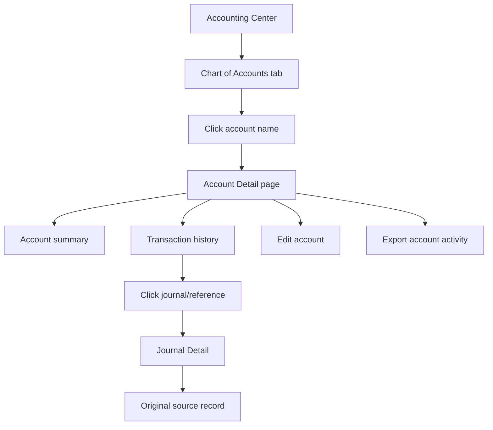
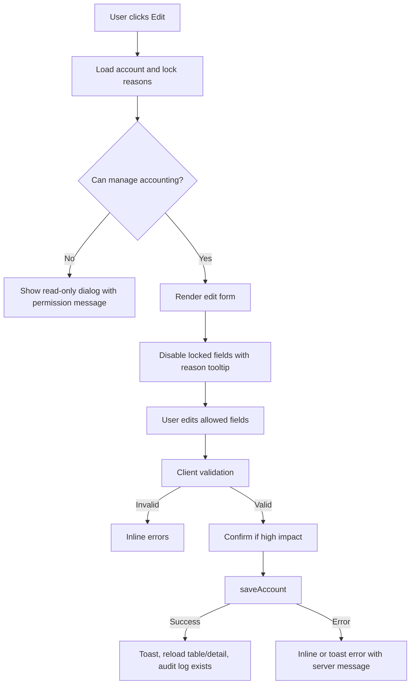

# Chart of Accounts Enhancement Recommendations

Date: 2026-07-26

Scope: Enhance the existing Accounting Center -> Chart of Accounts surface. Do
not redesign the page or replace the shipped table. The recommended path is to
add account-row navigation, accountant-friendly restrictions, lightweight list
affordances, and a dedicated Account Detail ledger page.

## Current FluxyOS Baseline

FluxyOS already has the right accounting foundation:

- `accounting.html` exposes Chart of Accounts as a tab inside Accounting Center.
- `assets/js/accounting.js` renders the existing CoA table with Code, Account,
  SAK Category, Type, Normal Balance, Status, and archive/reactivate actions.
- `chart_of_accounts/{code}` is workspace-scoped and seeded from
  `CHART_OF_ACCOUNTS_SEED` in `assets/js/accounting-engine.js`.
- Account code is immutable and equals the Firestore document id.
- `is_system` marks accounts used by posting/tax engines or default mappings.
- `is_active` is the archive flag. Archived accounts drop out of pickers but
  remain in ledger/trial-balance history.
- `parent_code` supports one-level hierarchy.
- `journals` and `ledger_balances` already power the General Ledger, Trial
  Balance, Statements, and Account Mapping flows.
- `saveAccount`, `archiveAccount`, `reactivateAccount`, `getGeneralLedger`, and
  `listJournals` already exist in `assets/js/db-service.js`.

The enhancement should preserve this foundation and extend it.

## Competitor Research Summary

### Jurnal by Mekari

Strengths:

- Treats the CoA as a back-office accounting surface, not a daily founder flow.
- Makes account names clickable into an account detail view where users can see
  related transactions, debit, credit, balance movement, date filters, and
  transaction click-through.
- Uses visible lock states. A standard lock means the account has transaction
  usage restrictions; a stronger default/system lock cannot have account
  category edited or be deleted.
- Supports account hierarchy through account headers and sub-accounts.
- Supports role/account access restrictions for sensitive accounts.
- Uses account mapping so product, POS, bills, and expenses inherit posting
  accounts.

Weaknesses:

- The lock model can be conceptually dense: users must learn lock versus
  stronger default lock.
- CoA remains accountant-first and exposes account coding prominently.

Product decision:

- Jurnal optimizes for auditability and Indonesian accounting workflows. It
  permits customization, but freezes fields that could change reporting meaning
  after historical postings exist.

### Xero

Strengths:

- Clear distinction between normal, locked, and system accounts.
- Locked accounts cannot be archived or deleted, but some metadata can still be
  edited by users with the right role.
- System accounts can be heavily restricted and may be unavailable for manual
  transaction use.
- Account Transactions and General Ledger reports provide account-level
  drill-downs.
- Strong export patterns around CoA and GL data.

Weaknesses:

- Archived accounts can still leak into report customization workflows, creating
  noise in old files.
- Account type customization is limited, which can frustrate specialized
  organizations.

Product decision:

- Xero keeps the accounting schema stable and pushes analysis into reports
  rather than overloading the CoA table.

### Accurate Online

Strengths:

- Uses Buku Besar -> Akun Perkiraan as the management home for accounts.
- Account create/edit is structured into tabs: general info, balance, and other
  settings.
- Supports sub-accounts through an explicit Sub Akun/parent account choice.
- Restricts direct opening balance entry for control accounts such as
  receivables, payables, inventory, fixed assets, and depreciation.
- Encourages non-active/archive instead of deleting accounts that matter to
  history.
- Lets administrators define user access to accounts.
- Preferensi -> Akun works as module-level default account mapping, reducing
  manual coding during transactions.

Weaknesses:

- Some account restrictions are only discovered while editing, which can feel
  reactive.
- The account setup model is powerful but closer to accountant/admin workflows
  than founder workflows.

Product decision:

- Accurate prioritizes module automation. The CoA configures the engine, then
  operational modules inherit default accounts automatically.

### Campfire

Strengths:

- Positions the general ledger as AI-assisted infrastructure for modern finance
  teams.
- Emphasizes automatic transaction categorization, duplicate/exception flagging,
  close automation, multi-entity support, sub-ledgers, and account
  reconciliation.
- AI learns from policies, chart of accounts, standards, and transaction
  history, while users keep approval thresholds and control.

Weaknesses:

- Public documentation is less detailed on exact CoA field-level restrictions.
- Enterprise/onboarding posture implies more setup effort than lightweight SMB
  tools.

Product decision:

- Campfire's modern lesson is not a radically different CoA table. It is a
  ledger-centered, automation-first workflow where the CoA powers categorization,
  close, reconciliations, and reporting in the background.

### QuickBooks Online

Strengths:

- Chart of accounts is treated as the full list of company accounts and balances.
- Account registers give users a dedicated account history with current balance.
- Inactive accounts preserve historical transactions and can be restored.
- Default/special accounts have explicit restrictions and cannot always be made
  inactive.
- Subaccounts are supported.
- Account numbers can be optional, which helps non-accountants.
- Audit log tracks financial and account activity.
- Advanced/accountant editions expose bulk reclassification workflows.

Weaknesses:

- Product-plan limits can affect account usage.
- Some "delete" language maps to inactive/archive behavior, which can confuse
  users.
- Advanced workflows may be spread across menus.

Product decision:

- QuickBooks prioritizes a familiar SMB accounting model: make the CoA easy to
  add to, but preserve historical integrity through inactive status, special
  account restrictions, account registers, and audit logs.

### Zoho Books

Strengths:

- Chart of Accounts sits in the Accountant area.
- Account Detail page is the center for edit, attach files, mark inactive, mark
  active, delete, and related account transactions.
- Bulk mark inactive exists for manually created accounts.
- System default accounts cannot be marked inactive.
- Sub-accounts are defined as child accounts under parent accounts and can be
  created from the CoA or some modules.
- Export current view and chart of accounts export patterns are clear.
- API exposes list, create, update, delete, active/inactive semantics.

Weaknesses:

- Some detail/action interactions rely on hover or More menus, which can hide
  important actions.
- Multiple regional help centers expose similar but slightly different docs.

Product decision:

- Zoho keeps the list clean and makes the detail page the account management and
  transaction review hub.

### Odoo

Strengths:

- CoA is under Accounting -> Configuration -> Chart of Accounts, reinforcing
  that it is accounting configuration.
- List is sortable by code, account name, type, and can be grouped through list
  controls.
- Account configuration carries operational behavior: account type, taxes, tags,
  reconciliation eligibility, and mapping for consolidation.
- Odoo automatically creates journal entries for accounting transactions.
- Journal items and general ledger reports provide transaction-level drill-down.

Weaknesses:

- Power comes with configuration density. The UI can feel ERP-heavy for SMBs.
- More of the detail is configuration-oriented than guided.

Product decision:

- Odoo treats accounts as configurable ledger objects whose metadata affects
  reports, reconciliation, taxes, and consolidation.

## Product Recommendations For FluxyOS

1. Keep the existing CoA table as the primary list.
2. Make every account name a link to an Account Detail page.
3. Use the Account Detail page as the single-account General Ledger view.
4. Add edit/account-management controls only where permissions and restrictions
   allow them.
5. Prefer archive/reactivate over delete. Keep hard delete unavailable.
6. Keep system-account protection stricter than user-created account protection.
7. Add a "locked because in use" concept separate from `is_system`.
8. Preserve the two-layer model: founder-facing Business Category plus
   accounting-facing CoA reference.
9. Use account detail and journal detail as the drill-down chain:
   CoA -> Account Detail -> Journal Detail -> Source Transaction.
10. Expose restrictions before the user acts, not only as submit errors.

## Editable, System, Locked, And Archived Rules

### Account States

System account:

- `is_system === true` or code is in `SYSTEM_ACCOUNT_CODES`.
- Used by posting engines, tax engines, required defaults, or fallback mappings.
- Cannot be deleted or archived.
- Should allow only low-risk display edits in a future phase if the engine stops
  denormalizing names from the seed. With the current engine, keep system account
  name locked.

User-created account:

- `is_system !== true` and code is not in `SYSTEM_ACCOUNT_CODES`.
- Can be edited subject to validation.
- Can be archived/reactivated.
- Cannot be deleted.

Locked account:

- Not necessarily system.
- Has posted activity in `ledger_balances`, is used by account mappings, is a
  parent with children, is used by module defaults, or belongs to a closed
  period's posting history.
- Can be renamed and localized.
- Cannot have structure changed in ways that alter historical reporting meaning.

Archived account:

- `is_active === false`.
- Hidden from new posting/account pickers by default.
- Visible in CoA when filter includes archived accounts.
- Visible in Account Detail, GL, Trial Balance, Statements, and exports when it
  has history.
- Can be reactivated if the user has permission.

### Field Edit Matrix

| Field / action | System account | User-created, unused | User-created, in use or mapped | Archived |
|---|---|---|---|---|
| `code` | Locked | Locked after create | Locked | Locked |
| `type` | Locked | Editable before save only | Locked | Locked |
| `normal_balance` | Locked | Derived, not editable | Derived, not editable | Derived, not editable |
| `sak_category` | Locked | Editable | Locked once in use | Locked until reactivated |
| `parent_code` | Locked | Editable | Locked once in use or if parent has posted children | Locked until reactivated |
| `name` | Locked in current engine | Editable | Editable | Editable only after reactivation |
| `name_id` | Locked in current engine | Editable | Editable | Editable only after reactivation |
| `opening_balance` | Locked after first posting | Editable only before activity and outside closed period | Locked | Locked |
| `is_active` | Always active | Archive/reactivate allowed | Archive/reactivate allowed if no required mapping/default depends on it | Reactivate allowed |
| Delete | Never | Never | Never | Never |

Recommended implementation note: current Phase 1 already locks `code`, `type`,
`normal_balance`, system edits, and deletes. The incremental change is to add the
"in use or mapped" lock check for `sak_category`, `parent_code`, and
`opening_balance`.

### Validation Rules

Code:

- Required on create.
- 4 digits, `1000` to `9999`.
- Document id must equal code.
- First digit must match account type:
  - `1xxx` asset
  - `2xxx` liability
  - `3xxx` equity
  - `4xxx` revenue
  - `5xxx`, `6xxx`, `8xxx` expense
  - `7xxx` revenue/other income
- Unique.
- Immutable after create.

Name:

- Required.
- Max 120 characters.
- Trim whitespace.
- Warn on exact duplicate active account name. Do not necessarily block
  duplicate names because some businesses intentionally use similar names across
  entities, but require unique code.

Indonesian name:

- Optional.
- Max 120 characters.

SAK category:

- Required for create.
- Must be one of `SAK_CATEGORIES`.
- Must be compatible with account type. For example, asset accounts cannot use
  `operating_expense`.
- Locked after posted activity exists.

Parent account:

- Optional.
- Parent must exist.
- Parent cannot be self.
- Parent must share the same `type`.
- Parent must share the same leading code block.
- Parent cannot be archived.
- Avoid deeper nesting for now; FluxyOS already models one-level hierarchy.

Opening balance:

- Store as raw integer Rupiah.
- Display as `Rp 1.234.567`.
- Only editable before activity exists.
- Direct opening balance should be blocked for control accounts:
  - Cash & Bank
  - Accounts Receivable
  - Accounts Payable
  - Tax receivable/payable accounts
  - Future inventory/fixed asset/depreciation accounts
- For blocked control accounts, direct users to source-module setup or opening
  balance journal.

Archive:

- Block system accounts.
- Block accounts currently assigned as required module defaults unless the user
  remaps first.
- Allow in-use non-system accounts, but warn that history remains in reports and
  account will be removed from new pickers.
- If account has non-zero balance, show warning and suggest adjustment/reclass
  before archive. Do not block expense/revenue accounts solely because the
  selected period has a balance; do consider stricter warnings for balance-sheet
  accounts.

### Error States And UI Copy

Use inline validation for forms and toast/dialog messages for action failures.
Recommended messages:

- System account: "This is a system account used by FluxyOS posting rules. It
  cannot be edited or archived."
- Locked by activity: "This account has posted activity, so category and parent
  cannot be changed. Rename is still allowed."
- Locked by mapping: "This account is used by Account Mapping. Remap the category
  before archiving."
- Locked by child accounts: "Move or archive child accounts before changing this
  parent."
- Archived account: "Archived accounts are hidden from new postings but remain in
  reports and ledger history."
- Closed period: "Opening balance cannot be changed because the account has
  posted activity or a closed period."
- Duplicate code: "Account code already exists."
- Invalid code/type: "Code 6425 must be an expense account."
- Parent invalid: "Parent account must be active and in the same account type."

## CoA Table UX Enhancements

Preserve table layout. Add small affordances:

- Make account name a text link:
  - Destination: `accounting-account.html?code=6420`
  - Keep row layout intact.
  - Add `title="Open account ledger"`.
- Add a compact lock/status indicator beside the name:
  - `System`
  - `Locked`
  - `Mapped`
  - `Archived`
- Replace the current text lock symbol with a consistent small badge. Avoid
  relying on emoji because it renders inconsistently.
- Add row hover state for navigable rows using existing
  `.fluxy-table-row-clickable` behavior.
- Add row actions:
  - View ledger
  - Edit
  - Archive/Reactivate
  - Run report or Export account activity
- Show disabled row actions with tooltip text when blocked.
- Improve hierarchy:
  - Keep indentation in the Code or Account column.
  - Add a disclosure control for parent accounts with children.
  - Default expanded for now because only 32 accounts exist.
  - Persist collapsed state in `localStorage` later if needed.
- Add filters above the table without changing table columns:
  - Search by code/name/category.
  - Status: Active, Archived, Locked, System.
  - Type: Asset, Liability, Equity, Revenue, Expense.
  - SAK Category.
  - "Show archived" toggle.
- Add summary chips in the header:
  - Active accounts count.
  - Archived accounts count.
  - System/locked count.
- Empty states:
  - No chart seeded: keep current seed/access guidance.
  - No filter results: "No accounts match these filters."
  - No archived accounts: "Archived accounts will appear here after you archive
    one."
- Add export current view as CSV for finance/accountant roles, using the existing
  controlled export/audit pattern from Reports.

## Account Detail Page

### Route

Create a new app page:

- HTML: `accounting-account.html`
- JS: `assets/js/accounting-account.js`
- Query: `?code=<accountCode>`
- Sidebar page key: `accounting`

Rationale: a route is better than an in-tab drawer because accountants often
deep-link account ledgers during close and audit review.

### Page Structure

Topbar:

- Breadcrumb: Accounting Center -> Chart of Accounts -> `6420 Rent Expense`
- Period/date range control.
- Actions: Edit, Archive/Reactivate, Export, Back to CoA.

Account summary band:

- Account code.
- Account name.
- SAK category.
- Type.
- Parent account.
- Opening balance.
- Current balance.
- Status: Active, Locked, Archived.
- System/mapped/in-use indicators.
- Created at/by and updated at/by when available.

Transaction history:

- Date.
- Description.
- Reference number.
- Source module.
- Debit.
- Credit.
- Running balance.
- Status.
- Click-through action.

Controls:

- Search.
- Date range.
- Source module filter:
  - Manual journal
  - Transactions
  - Bills
  - Invoices
  - Bank transactions
  - Revenue
  - Expenses
  - Adjustments
  - Transfers
  - Period close
- Debit/Credit/All side filter.
- Export.
- Pagination.

### Detail Data Contract

Add a DAL method rather than duplicating page queries:

```js
async getAccountDetail(userId, accountCode, {
  startDate = null,
  endDate = null,
  periodKey = null,
  search = '',
  sourceCollection = '',
  side = '',
  pageSize = 50,
  cursor = null
} = {})
```

Return:

```js
{
  account: {
    code,
    name,
    name_id,
    type,
    sak_category,
    parent_code,
    parent_name,
    normal_balance,
    opening_balance,
    current_balance,
    is_system,
    is_active,
    is_locked,
    lock_reasons,
    created_at,
    created_by,
    updated_at,
    updated_by
  },
  entries: [{
    journal_id,
    journal_number,
    journal_status,
    date,
    period_key,
    description,
    memo,
    reference_number,
    source_collection,
    source_id,
    source_module_label,
    source_href,
    debit,
    credit,
    running_balance,
    status
  }],
  openingBalanceForRange,
  closingBalance,
  totalDebit,
  totalCredit,
  pagination: { hasMore, nextCursor }
}
```

Minimum Phase 1 implementation can wrap `getGeneralLedger()` and enrich entries
from the journal object already returned by `listJournals()`. Later, introduce a
denormalized `journal_lines` collection or account/date index if volume grows.

### Page Flow



### Account Detail States

Loading:

- Skeleton summary band plus table skeleton.

No account:

- "Account not found."
- CTA: Back to Chart of Accounts.

No activity:

- "No activity for this account in the selected period."
- Secondary line: "Change the date range or open All Time."

Archived:

- Show neutral banner: "This account is archived. It remains visible because it
  has historical ledger activity."
- Hide new-posting actions.
- Show Reactivate when permitted.

Locked:

- Show lock reason chips.
- Disable forbidden edit fields.

Error:

- "Could not load account ledger. Try again."

## Editing Interaction Flow

Recommended UI: modal or side drawer opened from row action or Account Detail.
Keep it compact and use existing button/table styles.



High-impact edits that should require confirmation:

- Changing `sak_category`.
- Changing `parent_code`.
- Archiving an account with activity.
- Reactivating an account previously archived.
- Changing opening balance.

Low-impact edits:

- Name.
- Indonesian name.
- Notes, if added later.

## Integration With Existing Modules

Transactions:

- Existing transaction categories should continue resolving through
  `accounting_mappings` and engine defaults.
- Account Detail should show manual transactions and transaction-created journals
  via `journal.source.collection === 'transactions'`.
- Click-through should use `/ledger?record=<id>`.

Bills:

- Bill accrual/payment journals should appear on Account Detail for expense,
  payable, tax, and cash accounts.
- Click-through should use `/bill?record=<id>`.
- If archiving a mapped bill expense account, block until mappings are changed.

Invoices:

- Invoice journals should appear on revenue, receivable, tax, discount/return,
  and cash accounts.
- Click-through should use `/invoices?invoice=<id>` for invoice source records.
- Future line-item revenue mappings should update only future postings, not
  historical journals.

Revenue:

- Revenue Sync and imported revenue records should post to mapped revenue/cash
  accounts and be visible in account history.
- Preserve raw integer IDR display rules.

Journal Entries:

- Manual journals are first-class entries in Account Detail.
- Account Detail rows should click to `accounting-journal.html?id=<journalId>`.
- Posted journals remain immutable; corrections use reversal journals.

Reports:

- Trial Balance rows already drill to General Ledger. Extend this to optionally
  drill to Account Detail.
- Account Detail export should share naming and audit semantics with Reports:
  `account_activity_<code>_<date-range>.csv`.

Financial Statements:

- Statements continue reading `ledger_balances`.
- Account type and SAK category determine statement placement, so these fields
  are locked after activity.
- Archived accounts with balances remain in statements to preserve accuracy.

Account Mapping:

- Add "Mapped" indicators on CoA rows if account is referenced by active
  `accounting_mappings` or `business_categories`.
- Before archive, check active mappings and show the categories using the account.
- Provide a link to Account Mapping filtered by that account.

Permissions:

- View: owner, admin, finance, accountant, viewer.
- Create/edit/archive/reactivate: owner, admin, finance, accountant.
- Sensitive structural edits should be owner/admin/accountant preferred if roles
  become more granular later.
- Export: follow existing `FluxyAccessGuard`/Reports export permissions.

## Technical Implementation Considerations

Minimal disruption path:

1. Add Account Detail route using the existing app shell/sidebar.
2. Add account-name links to `renderChartOfAccounts()`.
3. Add a `getAccountDetail()` or `getAccountLedger()` wrapper in
   `db-service.js`.
4. Add lock-reason computation in `db-service.js`:
   - system code
   - ledger activity via `_accountInUse`
   - active mappings
   - required module defaults, when those settings exist
   - child accounts
   - closed period/opening balance constraints
5. Add edit drawer/modal using `saveAccount()` and existing validation.
6. Add account table filters in `accounting.js` with local client-side filtering.
7. Add Playwright tests for navigation, restrictions, archived visibility, and
   account detail transaction drill-down.

Data/query caution:

- `listJournals()` currently fetches recent journals and filters client-side.
  This is acceptable for current scale but not enough for high-volume account
  histories.
- Future scalable option: write `journal_lines/{journalId_lineIndex}` or
  `account_entries/{accountCode__date__journalLine}` at posting time, with
  fields needed by Account Detail. Keep `journals` as the source of truth.
- Do not hardcode `users/${uid}` paths. Continue using `DataService._scope()`.
- Keep posted journal names denormalized. Account renames should not rewrite
  historical journal line names unless a deliberate migration is designed.
- Audit every account create/update/archive/reactivate/export.
- Update Firestore rules if the UI exposes new mutable fields. Current rules are
  broad enough for basic creates/updates but do not enforce the full product
  lock matrix; the DAL must enforce it, and rules should be tightened when
  practical.

Recommended helper:

```js
async getAccountLockState(userId, accountCode) {
  return {
    is_system: true,
    is_locked: true,
    reasons: ['system_account', 'posted_activity'],
    editable_fields: ['name', 'name_id'],
    blocked_fields: {
      code: 'Account code is immutable.',
      sak_category: 'This account has posted activity.'
    },
    actions: {
      edit: true,
      archive: false,
      reactivate: false,
      delete: false
    }
  };
}
```

For current FluxyOS, set system account `editable_fields` to `[]` until journal
line name denormalization no longer depends on the static seed.

## Acceptance Criteria

- Existing Chart of Accounts layout and columns remain recognizable.
- Account names in the CoA table open Account Detail.
- Account Detail loads from `?code=<accountCode>` and shows account metadata.
- Account Detail shows journal-derived entries with debit, credit, running
  balance, source module, reference, status, search, filters, export, and
  pagination.
- Clicking an entry opens Journal Detail or the original source record.
- System accounts cannot be archived, deleted, or structurally edited.
- User-created accounts can be edited within validation rules.
- In-use accounts cannot change `sak_category`, `parent_code`, `type`,
  `normal_balance`, or opening balance.
- Archived accounts are hidden from new account pickers but visible in account
  history and reports.
- Mapped accounts cannot be archived without a clear remapping path.
- All account mutations write audit logs.
- Viewer role can read but cannot mutate.
- Empty, loading, error, locked, archived, and no-results states render clearly.
- No console errors, CSP/CORS/404/Firebase permission errors on Accounting Center
  or Account Detail.
- Existing CoA Phase 1 tests continue passing.

## Manual QA Checklist

Preparation:

- Read `docs/PROJECT_BACKGROUND.md`.
- Read `docs/QA_CHECKLIST.md` sections for app page, Firestore, and accounting
  changes.
- Use a workspace with seeded CoA and posted journals.

Chart of Accounts:

- Open `/accounting.html`, go to Chart of Accounts.
- Confirm existing table layout remains intact.
- Confirm every account name has a visible hover/focus state.
- Confirm clicking an account opens `/accounting-account.html?code=<code>`.
- Confirm system accounts show System/Locked indicator.
- Confirm archived accounts show Archived indicator when included.
- Confirm search by code/name/category works.
- Confirm filters do not break archive/reactivate actions.

Account Detail:

- Open an active account with activity.
- Confirm metadata renders: code, name, category, parent, opening balance,
  current balance, status, created/updated.
- Confirm entries show date, description, reference, source module, debit,
  credit, running balance, and status.
- Confirm running balance ties to General Ledger for the same account and period.
- Confirm date filters change results.
- Confirm search filters by description, memo, journal number, and reference.
- Confirm pagination works at page boundaries.
- Confirm export downloads CSV and records audit/export metadata.
- Confirm clicking a journal opens `accounting-journal.html?id=...`.
- Confirm clicking a source opens `/ledger`, `/bill`, or `/invoices` with the
  correct deep-link param.

Editing:

- As viewer, confirm edit/archive controls are hidden or disabled.
- As finance/accountant, edit a user-created unused account name and save.
- Try invalid code/type/category combinations and confirm inline errors.
- Try changing system account fields and confirm blocked state.
- Try archiving a system account and confirm blocked state.
- Try archiving a user-created account with activity and confirm warning.
- Try archiving an account used by mapping and confirm remap guidance.
- Reactivate an archived account and confirm it returns to pickers.
- Confirm all mutations have audit logs.

Regression:

- Run existing CoA tests.
- Run Accounting Center smoke tests.
- Verify browser console has no permission, CSP, CORS, 404, or Firebase errors.
- Verify Rupiah formatting uses `Rp` and dot thousands separators.
- Verify no new user-facing English copy is added without Indonesian counterpart
  if this becomes a shipped UI change.

## Source Notes

- Existing FluxyOS files reviewed:
  - `docs/PROJECT_BACKGROUND.md`
  - `docs/data-model/chart-of-accounts.md`
  - `docs/research/coa-strategy.md`
  - `accounting.html`
  - `assets/js/accounting.js`
  - `assets/js/db-service.js`
  - `assets/js/accounting-engine.js`
  - `firestore.rules`
  - `tests/chart-of-accounts.spec.js`
  - `tests/coa-phase1-qa.spec.js`
- External product research:
  - Jurnal by Mekari Help Center:
    - https://help-center.jurnal.id/hc/id/articles/5125487464985-Sekilas-Mengenai-Menu-Daftar-Akun-COA
    - https://help-center.jurnal.id/hc/id/articles/43413030370457
    - https://help-center.jurnal.id/hc/id/articles/7748075315353-FAQs-Daftar-Akun
    - https://help-center.jurnal.id/hc/id/articles/4500399573273-Akun-Multi-Level
    - https://help-center.jurnal.id/hc/id/articles/4415613153689-Bagaimana-Cara-Melakukan-Settings-Pemetaan-Akun
  - Xero Central:
    - https://central.xero.com/s/article/Add-or-edit-an-account-in-your-chart-of-accounts
    - https://central.xero.com/s/article/View-your-chart-of-accounts
    - https://central.xero.com/s/article/Locked-and-system-accounts-in-your-chart-of-accounts-US
    - https://central.xero.com/s/article/Account-Transactions-report-New
    - https://central.xero.com/s/article/General-Ledger-report
  - Accurate Online Help:
    - https://help.accurate.id/product/accurate-online/fitur-aol/buku-besar/akun-perkiraan/membuat-dan-mengelola-akun-perkiraan/
    - https://accurate.id/akuntansi/pengertian-chart-of-account/
  - Campfire:
    - https://campfire.ai/core-accounting
    - https://campfire.ai/accounting-intelligence
    - https://campfire.ai/
    - https://www.ycombinator.com/companies/campfire-2
  - QuickBooks / Intuit:
    - https://quickbooks.intuit.com/learn-support/en-us/help-article/chart-accounts/learn-chart-accounts-quickbooks-online/L2yc6KBob_US_en_US
    - https://quickbooks.intuit.com/learn-support/en-us/help-article/chart-accounts/manage-default-special-accounts-chart-accounts/L3WvLaIfa_US_en_US
    - https://quickbooks.intuit.com/learn-support/en-us/help-article/bank-transactions/account-registers-quickbooks-online/L8V2Hal1f_US_en_US
    - https://quickbooks.intuit.com/learn-support/en-us/help-article/list-management/delete-account-chart-accounts-quickbooks-online/L0KFpdIeu_US_en_US
    - https://quickbooks.intuit.com/learn-support/en-us/help-article/audit-log/use-audit-log-quickbooks-online/L2WoVnW6I_US_en_US
  - Zoho Books:
    - https://www.zoho.com/in/books/help/accountant/chart-of-accounts.html
    - https://www.zoho.com/us/books/help/accountant/sub-accounts.html
    - https://www.zoho.com/books/api/v3/chart-of-accounts/
  - Odoo:
    - https://www.odoo.com/documentation/19.0/applications/finance/accounting/get_started/chart_of_accounts.html
    - https://www.odoo.com/documentation/19.0/applications/finance/accounting.html
    - https://www.odoo.com/documentation/19.0/applications/finance/accounting/get_started/journals.html
    - https://www.odoo.com/documentation/19.0/applications/finance/accounting/get_started/consolidation.html
